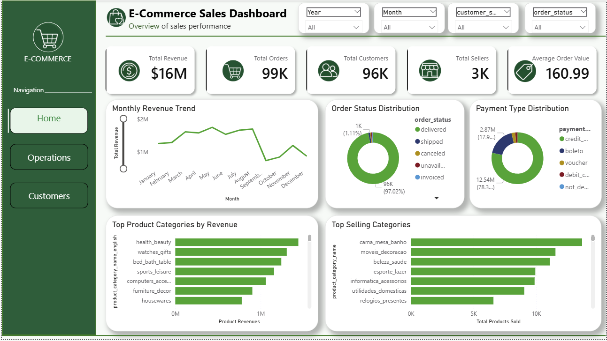
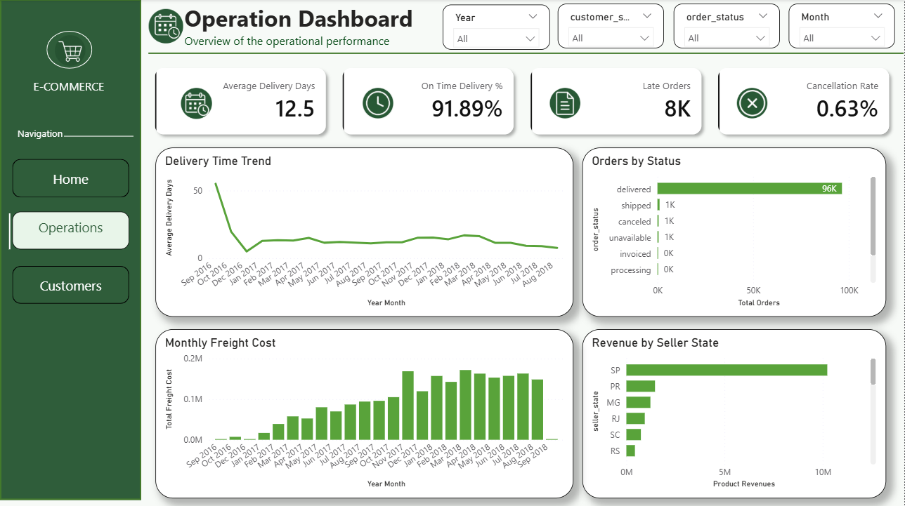
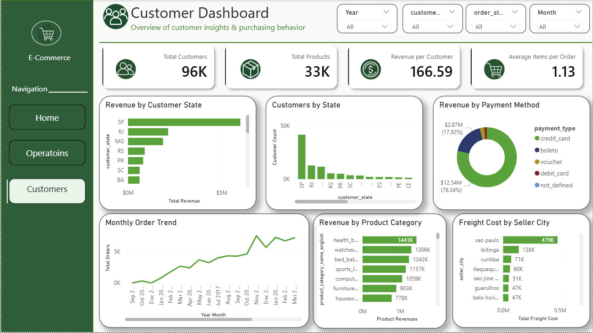

# 🛒 Power BI E-Commerce Analytics Dashboard




A professional Business Intelligence dashboard built using **Microsoft Power BI** to analyze the **Olist Brazilian E-Commerce Dataset**. This project transforms raw transactional data into meaningful business insights through interactive dashboards covering **Sales Performance**, **Operations**, and **Customer Analytics**.

---

# 📌 Project Overview

This project demonstrates the development of an interactive Business Intelligence solution using **Microsoft Power BI**. It transforms raw e-commerce transaction data into actionable insights through executive-level dashboards covering sales performance, operational efficiency, and customer analytics.

The dashboards are designed using modern visualization principles with interactive slicers, KPI cards, navigation buttons, and a consistent corporate theme to support data-driven decision-making.

---

# 🚀 Dashboard Pages

## Dashboard Navigation

- 📈 Executive Dashboard
- 🚚 Operations Dashboard
- 👥 Customer Dashboard

---

## 📈 Executive Dashboard

Provides a high-level overview of overall business performance.

### Key Performance Indicators (KPIs)

- Total Revenue
- Total Orders
- Total Customers
- Total Sellers

### Visualizations

- Revenue Trend
- Top Product Categories by Revenue
- Top Categories by Products Sold
- Revenue by Payment Method
- Order Status Distribution

---

## 🚚 Operations Dashboard

Focuses on logistics, delivery performance, and operational efficiency.

### KPIs

- Average Delivery Days
- On-Time Delivery Rate
- Late Deliveries
- Average Freight Cost

### Visualizations

- Delivery Time Trend
- Monthly Freight Cost
- Revenue by Seller State
- Orders by Status
- Top Seller States by Revenue

---

## 👥 Customer Dashboard

Provides insights into customer behavior and geographical distribution.

### KPIs

- Total Products
- Average Order Value
- Average Items per Order
- Average Freight Cost

### Visualizations

- Revenue by Customer State
- Customers by State
- Revenue by Payment Method
- Monthly Order Trend
- Revenue by Product Category
- Freight Cost by Seller City

---

# 🛠️ Technologies Used

- Microsoft Power BI Desktop
- Power Query
- DAX (Data Analysis Expressions)
- Data Modeling
- Data Visualization

### DAX Techniques Used

- Measures
- Calculated Columns
- Calendar Table
- Time Intelligence
- Aggregations
- Conditional Formatting

---

# ✨ Dashboard Features

- Interactive Navigation Buttons
- Dynamic Slicers and Filters
- Professional KPI Cards with Custom Icons
- Cross-Filtering Across Visuals
- Responsive Dashboard Layout
- Consistent Corporate Theme
- Custom DAX Measures
- Clean and Modern UI Design

---

# 📊 Key Business Insights

- Identified the highest revenue-generating product categories.
- Tracked monthly sales and order trends.
- Analyzed customer distribution across Brazilian states.
- Evaluated seller performance by region.
- Measured delivery efficiency and freight costs.
- Examined customer payment preferences.
- Monitored operational performance using logistics KPIs.

---

# 📂 Dataset

### Dataset Information

- **Dataset:** Olist Brazilian E-Commerce Public Dataset
- **Source:** Kaggle
- **Country:** Brazil
- **Records:** ~100,000 Orders

The dataset is **not included** in this repository to keep the repository lightweight.

Download the dataset from:

https://www.kaggle.com/datasets/olistbr/brazilian-ecommerce

---

# 📷 Dashboard Preview

## 📈 Executive Dashboard


---

## 🚚 Operations Dashboard



---

## 👥 Customer Dashboard



---

# 📁 Repository Structure

```text
PowerBI-Ecommerce-Analytics/
│
├── Images/
│   ├── executive-dashboard.png
│   ├── operations-dashboard.png
│   └── customer-dashboard.png
│
├── PowerBI-Ecommerce-Analytics.pbix
├── README.md
└── .gitignore
```

---

# ▶️ Getting Started

1. Clone this repository.
2. Download the Olist dataset from Kaggle.
3. Open `PowerBI-Ecommerce-Analytics.pbix` using Power BI Desktop.
4. Update the data source path if required.
5. Refresh the report.
6. Explore the dashboards using the interactive filters and navigation.

---

# 🎯 Skills Demonstrated

- Business Intelligence
- Dashboard Design
- Data Visualization
- Data Modeling
- Power Query
- DAX
- KPI Development
- Interactive Reporting
- Analytical Thinking